# Fire Red / Leaf Green style overworld sprites

Please give credit!

## Complete drag&drop pokeemerald FRLG overworld sprite style

> **Credit RavePossum, Poffin_Case**

`Poffin-Case-Overworlds-Converted` folder

These sprites are **drag and drop-ready** so all you need to do to implement them is replace all of the original files in `graphics/object_events/pics/people/`. Then, just make two tiny code changes so the fly animations line up properly. Click on the `Poffin-Case-Overworlds-Converted` folder for more details.

## Evil teams

## Team Rocket

> **Credit Pawkkie, the Project Palladium team**

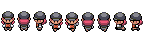

- Pawkkie's recolours to get down to 16 colour palettes and match HGSS trainer front sprites, reformatted for decomps
- Credit to the Project Palladium team for the original sprites, see that folder for details

> **Credit Galaxeeh, ebuddy/Silentninja**

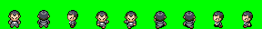
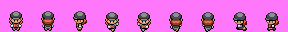  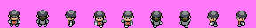

*Rocket grunts share a singular pallet

## Team Galaxy

> - **Credit Galaxeeh, PurpleZaffre** for Cyrus
> - **Credit Galaxeeh, Aveontrainer** for the rest

Overworld Trainer Sprite Resizes

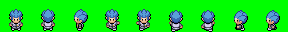
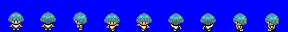
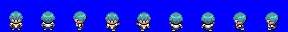
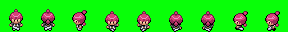
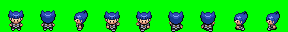

## Team Plasma

> - **Credit Galaxeeh, PurpleZaffre** for N
> - **Credit Galaxeeh, Aveontrainer** for the rest

Overworld Trainer Sprite Resizes

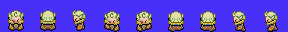
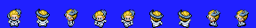
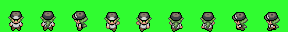
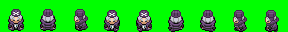

*Plasma grunts share a singular pallet

## Gym leaders

### Johto

#### Bugsy

> **Credit Galaxeeh, Aveontrainer**

Overworld Trainer Sprite Resize

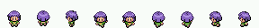

### B2W2

#### Roxie

> **Credit Galaxeeh, UlithiumDragon**

## Rivals

### Gary Oak

> **Credit ShinyDragonHunter**

Gary Oak recolor

## Protagonists

### May (ORAS)

> **Credit Pawkkie**

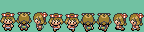

### Brendan (Emerald)

> **Credit Pawkkie**

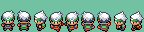

## Trainers / NPCs

#### Hex Maniac

##### Aveontrainer's

> **Credit Aveontrainer**

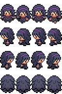

#### Pawkkie's reformat

> **Credit Pawkkie, Aveontrainer**

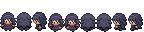

- Pawkkie's recolours to get down to 16 colour palettes, and reformatting for decomps
- Credit to aveontrainer for the original sprites
- DeviantArt link: https://www.deviantart.com/aveontrainer

## Miscellaneous

### Project Palladium asset resource

> **Credit the Project Palladium team**, see below for details on individual credits

- Large variety of assets
- Project Palladium was a GSC remake that was cancelled after HGSS
- The project team release all of their assets to the public for free use
- Initially released [here](http://psc.ramp-it.ca/stuffpds/), which has been a dead URL for some time. Wayback Machine has 1 saved instance in 2018.
- Please credit the entire team for used assets, as this collective decision has been massively beneficial to the community
- Individual credits are supplied with the spritesheets wherever they are known

#### Variety of Overworld Sprites
- Overworld sprites
- Pokemon by Coronis and BALLADOFWINDFISHES
- Room decoration by BALLADOFTHEWINDFISHES, Pokemon Tresures, Sneasel, KARR, celebi23, MATT, and GAMEGUY
- Trainers by Coronis, DARK a.k.a. AVATAR, Chris Klein a.k.a. Easter Eggs, sauce247, BALLADOFWINDFISHES, GAMEGUY, EPONA4, teamrocketspy, POKESHO.COM
- Rocket Grunt F reformated and recoloured by Pawkkie to match HGSS front sprite

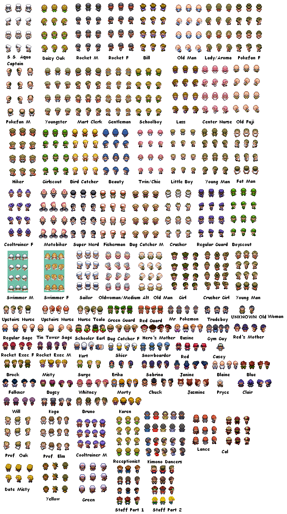
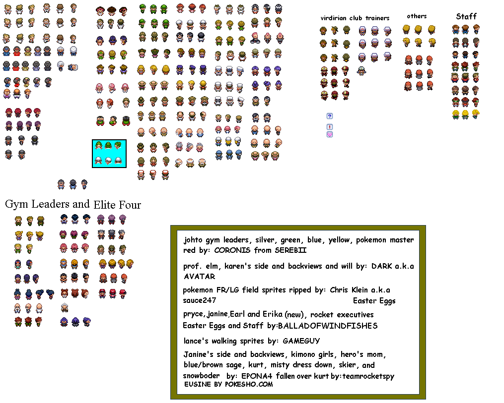

### HGSS Style Overworld Sprites

> **Credit Young-Dante**

DeviantArt link: https://www.deviantart.com/young-dante

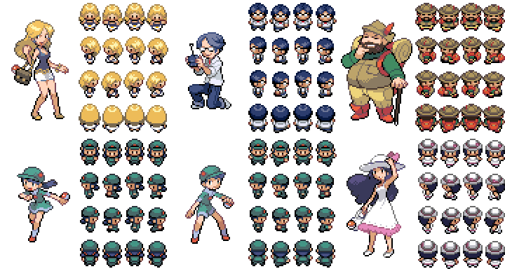
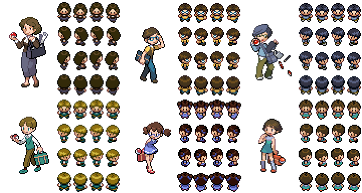